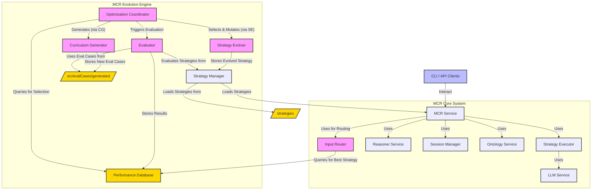

# 🧠 Model Context Reasoner (MCR) ✨

**For a high-level, marketing-oriented overview of MCR, its applications, and benefits, please see our [OVERVIEW.md](OVERVIEW.md).**

The **Model Context Reasoner (MCR)** is a powerful, API-driven system designed to act as a bridge between Large Language Models (LLMs) and formal logic reasoners (specifically Prolog). It enables applications to leverage sophisticated logical reasoning capabilities by translating natural language into formal logic and managing a persistent knowledge base through stateful sessions.

MCR is built with a "guitar pedal" 🎸 philosophy: a single, plug-and-play unit that adds advanced reasoning to your AI stack with minimal setup.

## 🌉 The MCR Philosophy: Bridging Worlds

MCR adds **general-purpose reasoning** to Language Model applications. It's a self-contained unit that you can easily "plug in" to an existing system to empower it with logic.

**Vision: The Symbiosis of Language and Logic:**
Large Language Models (LLMs) excel at understanding and generating human language, accessing vast knowledge, and performing nuanced contextual tasks. Formal logic systems, like Prolog, offer precision, verifiability, and the ability to perform complex deductive and inductive reasoning over structured knowledge.

MCR's vision is to create a seamless symbiosis between these two powerful paradigms. We believe that the future of advanced AI applications lies in systems that can:

- **Understand intent** through natural language (LLMs).
- **Structure knowledge** into formal representations (LLMs + MCR).
- **Reason rigorously** over that knowledge (Prolog via MCR).
- **Communicate results** back in an understandable way (MCR + LLMs).

This combination unlocks possibilities for more robust, explainable, and sophisticated AI systems.

## 🔑 Core Concepts

1.  **MCR Workbench & WebSocket API ⚙️**: MCR runs as a background server. The primary interaction method is through the **MCR Workbench**, a single-page web application that communicates with the server via a **WebSocket API**. This enables real-time updates and a more interactive experience.
2.  **Stateful Sessions 💾**: Clients (typically the MCR Workbench) create a `sessionId` to establish a persistent reasoning context. Each session contains:
    *   **Knowledge Base (KB) 📚**: A collection of symbolic logic clauses (facts and rules, typically in Prolog) representing the state of knowledge within that session. The MCR Workbench provides a live view of this KB.
3.  **LLM-Powered Translation 🗣️<->🧠**: MCR utilizes LLMs, guided by Translation Strategies, to translate between human language and formal logic.
4.  **Translation Strategies 🧩**: Encapsulated, interchangeable components that define the complete logic for converting natural language into symbolic clauses (for assertions) or symbolic queries. Each strategy embodies a specific methodology, including its own prompts and processing steps. This design allows for empirical measurement, comparison, and evolution of different translation approaches.
5.  **Structured Intermediate Representation (SIR) 🤖**: Some advanced Translation Strategies use an SIR (e.g., a JSON object) as an intermediate step. The LLM populates the SIR with the semantic meaning of a sentence, which is then programmatically and deterministically converted into the final symbolic syntax (e.g., Prolog). This mitigates LLM-induced syntax errors and improves reliability.

## 🚀 Features

- **🧩 Modularity**: Backend structured into logical components (Config, Logger, LLM Service, Reasoner Service, WebSocket Handler, Tool Definitions).
- **🤖 Extensible LLM Support**: Supports multiple LLM providers (OpenAI, Gemini, Ollama, etc.), selectable via configuration. (Refer to `.env.example` for details).
- **📚 Dynamic Lexicon Summary**: Automatically builds a lexicon of known predicates (name/arity) from asserted facts within a session. This summary is provided to the LLM during translation to improve consistency and accuracy.
- **🛡️ Robust Error Handling**: Structured error responses over WebSocket.
- **✅ Configuration Validation**: Checks for required API keys and settings on startup.
- **📦 Dependency Management**: Uses `package.json` for Node.js dependencies.
- **🖥️ MCR Workbench**: A comprehensive single-page web application for all interactions:
    -   **Interactive Session Mode**: Chat REPL, ontology management, demo execution, live KB view.
    -   **System Analysis Mode**: Strategy performance dashboards, curriculum explorer, evolution engine controls.
- **🔌 WebSocket API**: Real-time, message-based API for all client-server communication, replacing the previous REST API.

## 🏛️ System Architecture Diagram

The MCR is defined by a multi-layered, service-oriented architecture that promotes modularity and separation of concerns:

-   **Presentation Layer:** The **MCR Workbench** (`/ui` directory, a React SPA) is the primary presentation layer.
-   **API Layer:** A **WebSocket API** (`/ws` endpoint) handles all client-server communication using a JSON-based message protocol. Server-side, `websocketHandler.js` and `tools.js` define this layer.
-   **Service Layer:** The core orchestrator (`MCR Service`). It manages the business logic of a request (e.g., "assert this text") by invoking the currently selected Translation Strategy and the necessary providers.
-   **Provider & Strategy Interfaces:** A set of abstract contracts that define the capabilities of key components like LLM Providers, Reasoner Providers, and Translation Strategies. This allows for pluggable implementations.
-   **Implementation Layer:** Concrete implementations of the interfaces (e.g., specific LLM providers like Ollama or Gemini, a Prolog Reasoner, and various Translation Strategy modules).

The following diagram illustrates the main components of the MCR system, including the core reasoning services and the Evolution Engine:



## 🏁 Quick Start

This section guides you through getting MCR up and running quickly for development or local use. For using MCR as a published package in your own project, see the "📦 Using MCR as a Package" section below.

**1. Clone & Install (for Development):**

```bash
git clone http://dumb.ai # Replace with the actual repository URL if different
cd model-context-reasoner
npm install
```

**2. Configure LLM:**
Create a `.env` file in the project root (copy from `.env.example`) and add your chosen LLM provider API key and settings.

**3. Start the MCR Server:**

```bash
node mcr.js
```

The server will start, typically on `http://localhost:8080`. The MCR Workbench UI will be accessible at this address.

## 📦 Using MCR

The primary way to use MCR is by running the server and interacting with it through the **MCR Workbench** web application or by building a custom client that communicates via its **WebSocket API**.

**1. Running the MCR Server:**
Start the server as described in the "Quick Start" section:
```bash
node mcr.js
```
Ensure you have a `.env` file configured in your project's root directory. MCR will look for a `.env` file in the current working directory from where `node` is executed.

**2. Accessing the MCR Workbench:**
Once the server is running (e.g., on `http://localhost:8080`), open this address in your web browser to use the MCR Workbench.

**3. Programmatic API Interaction (WebSocket):**
Applications can interact with MCR programmatically by establishing a WebSocket connection to the server (typically at `ws://localhost:8080/ws`) and exchanging JSON messages. Refer to the **🔌 WebSocket API Reference** section below for details.

## 🔌 WebSocket API Reference

MCR uses a WebSocket-based API for all client-server communication.

- **Endpoint:** `ws://<server_host>:<server_port>/ws` (e.g., `ws://localhost:8080/ws`)
- **Protocol:** JSON messages.

### Key Message Types:

1.  **`connection_ack` (Server to Client)**
    -   Sent by the server upon successful WebSocket connection.
    -   **Payload:**
        ```json
        {
          "clientId": "string (UUID assigned by server)",
          "message": "string (Welcome message)",
          "availableTools": [
            { "name": "string (tool_name)", "description": "string" },
            // ... list of all available tools
          ]
        }
        ```

2.  **`tool_invoke` (Client to Server)**
    -   Used by the client to request a server-side action ("tool").
    -   **Message Structure:**
        ```json
        {
          "type": "tool_invoke",
          "correlationId": "string (client-generated UUID for tracking response)",
          "payload": {
            "tool_name": "string (name of the tool to invoke)",
            "input": { /* object specific to the tool */ }
          }
        }
        ```

3.  **`tool_result` (Server to Client)**
    -   Sent by the server in response to a `tool_invoke` message.
    -   **Message Structure:**
        ```json
        {
          "type": "tool_result",
          "correlationId": "string (echoed from client's tool_invoke message)",
          "payload": {
            "success": true | false,
            "data": { /* object: result of successful tool execution */ },
            "error": { /* object: details of error if success is false */
              "message": "string",
              "code": "string (optional error code)",
              "details": "any (optional additional details)"
            }
          }
        }
        ```

4.  **`kb_updated` (Server to Client)**
    -   Broadcast by the server when a session's knowledge base is updated (e.g., after an assertion).
    -   Clients subscribed to the relevant `sessionId` will receive this.
    -   **Payload:**
        ```json
        {
          "sessionId": "string",
          "knowledgeBase": "string (the complete current KB)",
          "triggeringTool": "string (e.g., 'assert_nl_to_session')",
          "addedFacts": ["string"] // Optional, included if applicable
        }
        ```

5.  **`client_update_session_subscription` (Client to Server)**
    - Used by the client to inform the server which session's `kb_updated` events it is interested in.
    - **Message Structure:**
        ```json
        {
          "type": "client_update_session_subscription",
          "payload": {
            "sessionId": "string (session ID to subscribe to, or null to unsubscribe)"
          }
        }
        ```

### Available Tools (partial list, see `src/tools.js` for full definitions):

The `tool_name` in a `tool_invoke` message corresponds to one of the tools defined in `src/tools.js`. Each tool expects a specific `input` object. Examples:

-   **`create_session`**: `input: { sessionId: "optional-string" }` (sessionId is optional)
-   **`assert_nl_to_session`**: `input: { sessionId: "string", naturalLanguageText: "string" }`
-   **`query_session_with_nl`**: `input: { sessionId: "string", naturalLanguageQuestion: "string", options: { debug?: boolean, style?: string } }`
-   **`get_full_kb_for_session`**: `input: { sessionId: "string" }`
-   **`list_ontologies`**: `input: { includeContent?: boolean }`
-   **`load_ontology_into_session`**: `input: { sessionId: "string", ontologyName: "string" }`
-   ... and many more covering session management, strategy management, direct translations, etc.

The MCR Workbench UI (`ui/src/apiService.js`) dynamically builds a client-side SDK to interact with these tools.

**Example Interaction (Conceptual):**

1.  Client connects to `/ws`.
2.  Server sends `connection_ack` with `clientId` and `availableTools`.
3.  Client wants to create a session:
    Sends: `{"type": "tool_invoke", "correlationId": "c1", "payload": {"tool_name": "create_session", "input": {}}}`
4.  Server processes, creates session "s1", and responds:
    Sends: `{"type": "tool_result", "correlationId": "c1", "payload": {"success": true, "data": {"id": "s1", ...}}}`
5.  Client wants to assert "Sky is blue" to session "s1":
    Sends: `{"type": "tool_invoke", "correlationId": "c2", "payload": {"tool_name": "assert_nl_to_session", "input": {"sessionId": "s1", "naturalLanguageText": "Sky is blue."}}}`
6.  Server processes, asserts, and responds:
    Sends: `{"type": "tool_result", "correlationId": "c2", "payload": {"success": true, "data": {"message": "Asserted.", "addedFacts": ["is_color(sky, blue)."]}}}`
7.  Server also broadcasts KB update to relevant clients:
    Sends: `{"type": "kb_updated", "payload": {"sessionId": "s1", "knowledgeBase": "is_color(sky, blue).", ...}}}`


**Direct Library Usage (Experimental/Advanced):**
While the primary way to use MCR is via its server and WebSocket API, core functionalities can be imported directly if you are embedding MCR within a larger Node.js application and managing the MCR lifecycle yourself. This is an advanced use case and requires careful setup.

```javascript
// main.js in your project
const mcrService = require('model-context-reasoner/src/mcrService');
// ... (ensure config and logger are appropriately handled) ...

async function useMcrDirectly() {
  const session = await mcrService.createSession();
  // ... use other mcrService functions ...
}
```

## 🛠️ Development Setup and Installation

1.  **Clone the Repository**:
    ```bash
    git clone http://dumb.ai # Replace with the actual repository URL if different
    cd model-context-reasoner
    ```
2.  **Install Dependencies**:
    ```bash
    npm install
    ```
3.  **Create `.env` file**:
    Copy `.env.example` to `.env` in the project root. Edit it to include your LLM API keys and any other necessary configurations.
    **Important:** The MCR server performs configuration validation on startup. If you select an `MCR_LLM_PROVIDER` that requires an API key, you **must** provide it.

4.  **Run the MCR Server & Workbench**:
    ```bash
    node mcr.js
    ```
    The server will log its status. Open `http://localhost:8080` (or the configured port) in your browser to access the MCR Workbench. The React UI is served directly by the Express server for development (no separate build step needed for basic operation due to vanilla JS module usage).

#### Debugging Configuration

MCR uses an environment variable `MCR_DEBUG_LEVEL` to control the verbosity of debug information in API responses and server logs.

- **`MCR_DEBUG_LEVEL`**: Set this in your `.env` file.
  - `none` (Default): Minimal debug information.
  - `basic`: Essential debug fields (like generated Prolog query) and summaries.
  - `verbose`: Full, detailed debug information. **Use with caution.**

This server-side setting influences the content of `debugInfo` objects sent in `tool_result` messages, particularly for query operations.

## 🤖 MCR Evolution Engine

MCR includes a sophisticated **Evolution Engine**, a supervisory control loop designed to autonomously discover, evaluate, and refine translation strategies. This engine works to continuously improve MCR's performance, accuracy, and efficiency over time.

The system is bootstrapped with functional, human-authored strategies, ensuring immediate usability. The evolution process runs asynchronously (typically offline), augmenting the pool of available strategies.

### Core Components:

1.  **Optimization Coordinator (`src/evolution/optimizer.js`)**:
    - Orchestrates the entire evolution loop.
    - On first run (or with `--runBootstrap`), it executes all pre-defined strategies against an evaluation curriculum to establish baseline performance data in the `Performance Database`.
    - Selects existing strategies for improvement based on performance data.
    - Invokes the `StrategyEvolver` to create new candidate strategies.
    - May invoke the `CurriculumGenerator` to create new, targeted evaluation examples.
    - Evaluates new strategies and persists their performance.

2.  **Strategy Evolver (`src/evolution/strategyEvolver.js`)**:
    - Creates new candidate strategies by mutating existing ones.
    - The primary mutation method is "Iterative Critique":
      1.  Selects a node in a strategy graph (e.g., an `LLM_Call` node).
      2.  Extracts its prompt and identifies failing examples from the `Performance Database`.
      3.  Uses an LLM to critique and rewrite the prompt to address these failures.
      4.  Creates a new strategy JSON definition with the updated prompt.

3.  **Curriculum Generator (`src/evolution/curriculumGenerator.js`)**:
    - Expands the set of evaluation cases to prevent overfitting and ensure strategies are robust.
    - Analyzes performance data to identify weaknesses or gaps in the current curriculum.
    - Uses an LLM to generate new `EvaluationCase` objects targeting these areas. These are saved in `src/evalCases/generated/`.

4.  **Input Router (`src/evolution/inputRouter.js`)**:
    - Integrated into `mcrService.js` to select the optimal strategy for a given live input at runtime.
    - Performs a quick classification of the input.
    - Queries the `Performance Database` for the strategy with the best aggregate performance (metrics, cost, latency) for that input class and the current LLM.

The Evolution Engine also supports:
- **Benchmarking:** Standardized evaluation of strategies against a "golden dataset" of NL-to-Symbolic mappings, using metrics for syntactic accuracy, semantic correctness, and resource cost (latency, tokens).
- **Automated Optimization:** The system facilitates an automated loop where the `OptimizationCoordinator` can programmatically generate variations of existing strategy prompts (via the `StrategyEvolver`), benchmark them, and promote superior versions based on data from the `Performance Database`.

### Performance Database (`performance_results.db`)

This SQLite database is crucial for the Evolution Engine. It stores the detailed results of every evaluation run.

- **Purpose**:
  - Provides data for the `OptimizationCoordinator` to select strategies for evolution.
  - Gives context to the `StrategyEvolver` (e.g., failing examples).
  - Informs the `CurriculumGenerator` about areas needing more test cases.
  - Allows the `InputRouter` to make data-driven decisions at runtime.
  - Serves as a rich dataset for analyzing strategy performance and for potential fine-tuning of models.
- **Schema (`performance_results` table)**:
  - `id` (INTEGER PK): Unique ID for the run.
  - `strategy_hash` (TEXT): SHA-256 hash of the strategy's JSON definition.
  - `llm_model_id` (TEXT): Identifier of the LLM used (e.g., "ollama/llama3").
  - `example_id` (TEXT): ID of the `EvaluationCase` used.
  - `metrics` (JSON TEXT): JSON object of metric scores (e.g., `{ "exactMatchProlog": 1, ... }`).
  - `cost` (JSON TEXT): JSON object of cost metrics (e.g., `{ "prompt_tokens": 120, "completion_tokens": 80, "total_tokens": 200 }`).
  - `latency_ms` (INTEGER): Total time for the execution in milliseconds.
  - `timestamp` (DATETIME): UTC timestamp of the evaluation run.
  - `raw_output` (TEXT): The final string or JSON array output of the strategy.

### Running the Optimizer

The Optimization Coordinator can be run as a standalone script:

```bash
node src/evolution/optimizer.js [options]
```

**Common Options:**

- `--iterations <num>` or `-i <num>`: Number of evolution cycles to run (default: 1).
- `--bootstrapOnly`: Only run the bootstrap/baselining step and exit.
- `--runBootstrap`: Run bootstrap before starting iterations (useful if DB is empty or needs refreshing).
- `--evalCasesPath <path>`: Path to evaluation cases (default: `src/evalCases`).

**Example:**
To run bootstrap and then 3 evolution iterations:

```bash
node src/evolution/optimizer.js --runBootstrap --iterations 3
```

### Performance Dashboard TUI

To explore the `performance_results.db` and view strategy performance, use the Performance Dashboard TUI:

```bash
./cli.js perf-dashboard
```

This interface allows you to:

- List all evaluated strategy hashes.
- Select a strategy to view its individual evaluation runs.
- See detailed metrics, cost, latency, and raw output for each run.
- View overall summary statistics from the database.

### Example Translation Strategy Approaches

MCR's flexibility comes from its use of different Translation Strategies. These strategies define how natural language is converted to logic. Here are a couple of conceptual approaches:

1.  **Direct-to-Symbolic (e.g., `Direct-S1` strategy family):**
    *   **Description:** A baseline approach where the LLM is prompted to directly output symbolic logic (e.g., Prolog facts/rules or queries).
    *   **Assertion Logic:**
        1.  Generate a prompt asking the LLM to convert input text into one or more symbolic facts or rules.
        2.  Invoke the LLM.
        3.  Perform minimal post-processing (e.g., splitting into clauses).
    *   **Query Logic:**
        1.  Generate a prompt asking the LLM to convert an input question into a symbolic query.
        2.  Invoke the LLM.
        3.  Clean and return the string.
    *   **Pros:** Simpler to implement initially.
    *   **Cons:** More prone to LLM-induced syntax errors or inconsistencies.

2.  **Structured Intermediate Representation (e.g., `SIR-R1` strategy family):**
    *   **Description:** A more robust, multi-stage approach using a Structured Intermediate Representation (SIR) – often a JSON object – to ensure syntactic correctness and improve reliability.
    *   **Assertion Logic:**
        1.  _(Optional)_ **Intent Classification:** LLM classifies input as asserting facts or a rule.
        2.  **SIR Generation:** Based on intent (or directly), an LLM generates an SIR object. The prompt includes the SIR's schema definition and examples.
        3.  **SIR Validation:** The system parses and validates the SIR against its schema.
        4.  **Syntactic Translation:** The system programmatically traverses the validated SIR to deterministically generate syntactically correct symbolic clauses.
    *   **Query Logic (can also use SIR or be direct):**
        1.  LLM generates a symbolic query (potentially via an SIR for complex queries).
        2.  Clean and return the string.
    *   **Pros:** Significantly reduces syntax errors from LLMs; more robust and maintainable.
    *   **Cons:** More complex to set up initially, requires defining SIR schemas.

The MCR system allows for these and other strategy types to be defined and managed, with the Evolution Engine working to find or create the most effective ones for different tasks.

The MCR Evolution Engine, along with its components like the Optimization Coordinator, Strategy Evolver, and Curriculum Generator, remains a core part of the MCR backend. The MCR Workbench's "System Analysis Mode" is designed to provide a user interface for interacting with and monitoring this engine.

The `performance_results.db` continues to be central to this process.

### Running the Optimizer & Performance Dashboard

The methods for running the `OptimizationCoordinator` (e.g., `node src/evolution/optimizer.js`) and accessing performance data (previously via `./cli.js perf-dashboard`) will now be primarily managed and visualized through the MCR Workbench's System Analysis Mode. The underlying scripts and database remain crucial.

### Example Translation Strategy Approaches

The conceptual approaches for Translation Strategies (Direct-to-Symbolic, Structured Intermediate Representation) are still valid and fundamental to how MCR translates between natural language and logic. These strategies are managed and selected by the backend services and can be monitored and configured via the MCR Workbench.

## 🛠️ Utility Scripts for Development

The utility scripts `generate_example.js` and `generate_ontology.js` remain valuable for development.

### 1. Generate Evaluation Examples (`generate_example.js`)
- **Purpose:** Automatically creates new evaluation cases.
- **Command:**
  ```bash
  node ./generate_example.js --domain "<domain_name>" --instructions "<detailed_instructions_for_LLM>" [--provider <llm_provider>] [--model <model_name>]
  ```
- **Output:** Saves a new JavaScript file to `src/evalCases/`.

### 2. Generate Ontology (`generate_ontology.js`)
- **Purpose:** Automatically generates Prolog facts and rules for a specified domain.
- **Command:**
  ```bash
  node ./generate_ontology.js --domain "<domain_name>" --instructions "<detailed_instructions_for_LLM>" [--provider <llm_provider>] [--model <model_name>]
  ```
- **Output:** Saves a new Prolog file to `ontologies/`.

## Code Guidelines

- Aim for self-documenting code through clear naming and structure.
- Use JSDoc for public functions/modules: document parameters, return values, and purpose.
- Comment complex or non-obvious logic.

## Extensibility

### Adding a New LLM Provider

To add support for a new LLM provider (e.g., "MyNewLLM"):

1.  **Create Provider Module**:
    - Add a new file, e.g., `src/llmProviders/myNewLlmProvider.js`.
    - This module must export an object with at least:
      - `name` (string): The identifier for the provider (e.g., `'mynewllm'`).
      - `generate` (async function): A function `async (systemPrompt, userPrompt, options) => { ... }` that interacts with the LLM and returns the generated text string.
    - Example:

      ```javascript
      // src/llmProviders/myNewLlmProvider.js
      const logger = require('../logger'); // Assuming logger is available
      // const { SomeApiClient } = require('some-llm-sdk');

      const MyNewLlmProvider = {
        name: 'mynewllm',
        async generate(systemPrompt, userPrompt, options = {}) {
          // const apiKey = config.llm.mynewllm.apiKey; // Get from config
          // const model = config.llm.mynewllm.model;
          // if (!apiKey) throw new Error('MyNewLLM API key not configured');
          logger.debug(
            `MyNewLlmProvider generating text with model: ${model}`,
            { systemPrompt, userPrompt, options }
          );
          // ... logic to call the LLM API ...
          // return generatedText;
          throw new Error('MyNewLlmProvider not implemented yet');
        },
      };
      module.exports = MyNewLlmProvider;
      ```

2.  **Register in `src/llmService.js`**:
    - Import your new provider: `const MyNewLlmProvider = require('./llmProviders/myNewLlmProvider');`
    - Add a `case` for `'mynewllm'` in the `switch` statement within the `getProvider()` function to set `selectedProvider = MyNewLlmProvider;`.

3.  **Update Configuration (`src/config.js`)**:
    - Add a configuration section for your provider under `config.llm`:
      ```javascript
      // In config.js, inside the config object:
      llm: {
        provider: process.env.MCR_LLM_PROVIDER || 'ollama',
        // ... other providers ...
        mynewllm: { // Add this section
          apiKey: process.env.MYNEWLLM_API_KEY,
          model: process.env.MCR_LLM_MODEL_MYNEWLLM || 'default-model-for-mynewllm',
          // ... other specific settings for MyNewLLM
        },
      }
      ```
    - Update `validateConfig()` in `src/config.js` if your provider has mandatory configuration (e.g., API key).

4.  **Update `.env.example`**:
    - Add environment variable examples for your new provider (e.g., `MYNEWLLM_API_KEY`, `MCR_LLM_MODEL_MYNEWLLM`).

5.  **Documentation**:
    - Briefly mention the new provider in this README if applicable.

### Future Directions and Advanced Capabilities

The MCR architecture is designed to support further enhancements, including:

-   **Operational Enhancements:**
    -   **Self-Correction:** If a strategy step fails (e.g., an LLM produces an invalid SIR), the system could automatically re-prompt the LLM with the context of the error, asking it to correct its previous output.
    -   **Knowledge Retraction:** Extending MCR to understand commands for retracting or modifying existing knowledge would require changes to intent classification and the generation of retraction clauses.
    -   **Explanatory Reasoning:** The underlying reasoner provider could be extended to optionally return a proof trace, which an LLM could then translate into a human-readable explanation of reasoning steps.
-   **Paradigm Expansion:**
    -   **Hybrid Reasoning:** The system could support a fallback mechanism where, if a symbolic query yields no results, the query is re-posed to the base LLM for a general, sub-symbolic lookup.
    -   **Agentic Tooling:** MCR can be integrated as a "tool" within larger AI agent frameworks, allowing autonomous agents to delegate structured reasoning tasks.

---
