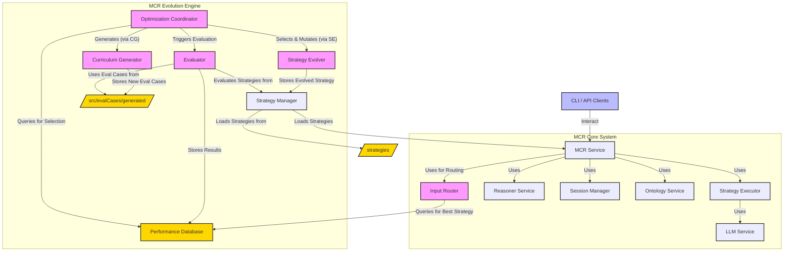

# 🧠 Model Context Reasoner (MCR) ✨

**For a high-level, marketing-oriented overview of MCR, its applications, and benefits, please see our [OVERVIEW.md](OVERVIEW.md).**

The **Model Context Reasoner (MCR)** is a powerful, API-driven system designed to act as a bridge between Large Language Models (LLMs) and formal logic reasoners (specifically Prolog). It enables applications to leverage sophisticated logical reasoning capabilities by translating natural language into formal logic and managing a persistent knowledge base through stateful sessions.

MCR is built with a "guitar pedal" 🎸 philosophy: a single, plug-and-play unit that adds advanced reasoning to your AI stack with minimal setup.

## 🌉 The MCR Philosophy: Bridging Worlds

MCR adds **general-purpose reasoning** to Language Model applications. It's a self-contained unit that you can easily "plug in" to an existing system (via its API) to empower it with logic.

**Vision: The Symbiosis of Language and Logic:**
Large Language Models (LLMs) excel at understanding and generating human language, accessing vast knowledge, and performing nuanced contextual tasks. Formal logic systems, like Prolog, offer precision, verifiability, and the ability to perform complex deductive and inductive reasoning over structured knowledge.

MCR's vision is to create a seamless symbiosis between these two powerful paradigms. We believe that the future of advanced AI applications lies in systems that can:

- **Understand intent** through natural language (LLMs).
- **Structure knowledge** into formal representations (LLMs + MCR).
- **Reason rigorously** over that knowledge (Prolog via MCR).
- **Communicate results** back in an understandable way (MCR + LLMs).

This combination unlocks possibilities for more robust, explainable, and sophisticated AI systems.

## 🔑 Core Concepts

1.  **MCR as a Service ⚙️**: MCR runs as a background HTTP server, exposing its functionality via a RESTful API. Any application can integrate with it.
2.  **Stateful Sessions 💾**: Clients create a `sessionId` to establish a persistent reasoning context. Each session contains:
    *   **Knowledge Base (KB) 📚**: A collection of symbolic logic clauses (facts and rules, typically in Prolog) representing the state of knowledge within that session.
3.  **LLM-Powered Translation 🗣️<->🧠**: MCR utilizes LLMs, guided by Translation Strategies, to translate between human language and formal logic.
4.  **Translation Strategies 🧩**: Encapsulated, interchangeable components that define the complete logic for converting natural language into symbolic clauses (for assertions) or symbolic queries. Each strategy embodies a specific methodology, including its own prompts and processing steps. This design allows for empirical measurement, comparison, and evolution of different translation approaches.
5.  **Structured Intermediate Representation (SIR) 🤖**: Some advanced Translation Strategies use an SIR (e.g., a JSON object) as an intermediate step. The LLM populates the SIR with the semantic meaning of a sentence, which is then programmatically and deterministically converted into the final symbolic syntax (e.g., Prolog). This mitigates LLM-induced syntax errors and improves reliability.

## 🚀 Features

- **🧩 Modularity**: Structured into logical components (Config, Logger, LLM Service, Reasoner Service, API Handlers).
- **🤖 Extensible LLM Support**: Supports multiple LLM providers (OpenAI, Gemini, Ollama, etc.), selectable via configuration. (Refer to `.env.example` for details).
- **📚 Dynamic Lexicon Summary**: Automatically builds a lexicon of known predicates (name/arity) from asserted facts within a session. This summary is provided to the LLM during translation to improve consistency and accuracy in generating Prolog facts, rules, and queries. It helps the LLM prefer existing predicates and understand their usage.
- **🛡️ Robust Error Handling**: Custom `ApiError` class and centralized error-handling.
- **✅ Configuration Validation**: Checks for required API keys and settings on startup.
- **📦 Dependency Management**: Uses `package.json` for Node.js dependencies.
- **💬 Interactive TUI**: An Ink-based Terminal User Interface for chat, session management, and more.
- **⚙️ CLI**: A command-line interface for server control, direct API interaction, demos, and a sandbox mode.
- **📃 API**: A comprehensive RESTful API for programmatic integration.

## 🏛️ System Architecture Diagram

The MCR is defined by a multi-layered, service-oriented architecture that promotes modularity and separation of concerns:

-   **Presentation Layer:** Any user-facing application that consumes the MCR's API (e.g., GUI Workbench, CLI, API Client).
-   **API Layer:** Defines the formal contract for interacting with the MCR (e.g., RESTful HTTP endpoints). It is stateless and forwards requests to the Service Layer.
-   **Service Layer:** The core orchestrator (`MCR Service`). It manages the business logic of a request (e.g., "assert this text") by invoking the currently selected Translation Strategy and the necessary providers.
-   **Provider & Strategy Interfaces:** A set of abstract contracts that define the capabilities of key components like LLM Providers, Reasoner Providers, and Translation Strategies. This allows for pluggable implementations.
-   **Implementation Layer:** Concrete implementations of the interfaces (e.g., specific LLM providers like Ollama or Gemini, a Prolog Reasoner, and various Translation Strategy modules).

The following diagram illustrates the main components of the MCR system, including the core reasoning services and the Evolution Engine:



## 🏁 Quick Start

This section guides you through getting MCR up and running quickly for development or local use. For using MCR as a published package in your own project, see the "📦 Using MCR as a Package" section below.

**1. Clone & Install (for Development):**

```bash
git clone http://dumb.ai # Replace with the actual repository URL if different
cd model-context-reasoner
npm install
```

**2. Configure LLM:**
Create a `.env` file in the project root (copy from `.env.example`) and add your chosen LLM provider API key and settings.

**3. Start the MCR Server:**

```bash
node mcr.js
# OR using the CLI (from the project root):
# ./cli.js start-server
```

The server will start, typically on `http://localhost:8080`.

**4. Use the Interactive TUI Chat:**
In another terminal, once the server is running (from the project root):

```bash
./cli.js chat
```

This launches the Ink-based TUI. Type `/help` for commands.

**5. Alternative Simple Chat (from the project root):**

```bash
npm run chat
# OR
node chat.js
```

This runs a simpler inquirer-based chat interface.

## 📦 Using MCR as a Package

Once MCR is published, you can install it in your Node.js project:

```bash
npm install model-context-reasoner
```

After installation, MCR primarily provides two ways to be utilized:

**1. Running the MCR Server:**
The core functionality of MCR is delivered via its server. You can start it from your project's `node_modules` directory or using a script in your `package.json`.

- **From `node_modules`:**

  ```bash
  node ./node_modules/model-context-reasoner/mcr.js
  ```

  Ensure you have a `.env` file configured in your project's root directory, or that the necessary environment variables (like `MCR_LLM_PROVIDER`, `OPENAI_API_KEY`, etc.) are set in your environment. MCR will look for a `.env` file in the current working directory from where `node` is executed.

- **Using `npx` (recommended for easy execution):**
  `npx` can execute package binaries. Since `mcr-cli` (which points to `cli.js`) is the registered binary for this package, you can use `npx mcr-cli <command>`. For example, to start the server:

  ```bash
  npx mcr-cli start-server
  ```

  Ensure any required `.env` file is present in the directory where you run this command.

- **Via `package.json` script in your project:**
  In your project's `package.json`:
  ```json
  "scripts": {
    "start-mcr": "node ./node_modules/model-context-reasoner/mcr.js"
  }
  ```
  Then run:
  ```bash
  npm run start-mcr
  ```

**2. Using the `mcr-cli` Command-Line Tool:**
When you install the `model-context-reasoner` package, the `mcr-cli` command should become available in your environment (if `npm install -g` was used or if your local `node_modules/.bin` is in your PATH).

```bash
mcr-cli --help # See available commands
mcr-cli start-server # Starts the MCR server
mcr-cli chat # Starts the TUI chat (requires server to be running)
mcr-cli status
mcr-cli create-session
# ... and other CLI commands
```

The `mcr-cli` will also respect the `.env` file in the directory from which it's run.

**3. Programmatic API Interaction:**
Once the MCR server is running (either started from a cloned MCR repository or from an installed package as described above), your application can interact with it programmatically by making HTTP requests to its REST API.

Refer to the **🔌 API Reference** section below for details on available endpoints, request formats, and response structures. You can use any HTTP client library in your language of choice (e.g., `axios` or `node-fetch` for Node.js, `requests` for Python).

## 🔌 API Reference

The MCR service exposes a RESTful API for interaction.

- **`POST /api/v1/sessions`**
  - **Description:** Creates a new reasoning session.
  - **Response Body:** `{ "id": "string" }` (Note: `sessionId` is often used in docs, but API returns `id`)

- **`POST /api/v1/sessions/{sessionId}/assert`**
  - **Description:** Asserts new knowledge into the session's KB using the currently configured Translation Strategy.
  - **Request Body:** `{ "text": "string" }`
  - **Response Body (Success):** `{ "success": true, "message": "string", "addedFacts": ["string"], "strategyId": "string", "cost": { ... } }`
  - **Response Body (Error):** `{ "success": false, "message": "string", "error": "string", "details": "string", "strategyId": "string", "cost": { ... } }`

- **`POST /api/v1/sessions/{sessionId}/query`**
  - **Description:** Poses a natural language query to the session's KB.
  - **Request Body:** `{ "query": "string", "options": { "debug": boolean, "dynamicOntology": "string", "style": "string" } }`
  - **Response Body (Success):** `{ "success": true, "answer": "string", "debugInfo": { ... } }`
  - **Response Body (Error):** `{ "success": false, "message": "string", "debugInfo": { ... }, "error": "string", "details": "string", "strategyId": "string" }`

- **`PUT /api/v1/sessions/{sessionId}/kb`**
  - **Description:** Directly overwrites the entire KB of a session. The new KB is validated before being saved.
  - **Request Body:** `{ "knowledgeBase": "string" }`
  - **Response Body:** `200 OK` or error object.

- **`GET /api/v1/sessions/{sessionId}`**
  - **Description:** Retrieves details for a specific session, including its KB and lexicon summary.
  - **Response Body:** `{ "id": "string", "knowledgeBase": "string", "lexiconSummary": "string", "createdAt": "timestamp" }`

- **`DELETE /api/v1/sessions/{sessionId}`**
  - **Description:** Deletes a specific session.
  - **Response Body:** `204 No Content` or error object.

- **`GET /api/v1/config/translation-strategy`**
  - **Description:** Gets the currently active base translation strategy ID.
  - **Response Body:** `{ "strategyId": "string" }`

- **`PUT /api/v1/config/translation-strategy`**
  - **Description:** Sets the active base Translation Strategy for the system.
  - **Request Body:** `{ "strategyId": "string" }`
  - **Response Body:** `{ "success": true, "message": "string", "strategyId": "string" }` or error object.

- **`GET /api/v1/strategies`**
  - **Description:** Lists all available translation strategies.
  - **Response Body:** `{ "strategies": [{ "id": "string", "name": "string", "description": "string" }, ...] }`

- **`POST /api/v1/translate/nl-to-rules`**
  - **Description:** Translates natural language text directly into Prolog rules.
  - **Request Body:** `{ "text": "string", "strategyId": "string" (optional) }`
  - **Response Body (Success):** `{ "success": true, "rules": ["string"], "strategyId": "string" }`

- **`POST /api/v1/translate/rules-to-nl`**
  - **Description:** Translates Prolog rules directly into a natural language explanation.
  - **Request Body:** `{ "rules": "string", "style": "string" (optional) }`
  - **Response Body (Success):** `{ "success": true, "explanation": "string" }`

- **`POST /api/v1/explain-query/{sessionId}`**
  - **Description:** Explains a natural language question in the context of a session.
  - **Request Body:** `{ "query": "string" }`
  - **Response Body (Success):** `{ "success": true, "explanation": "string", "debugInfo": { ... } }`

- **`GET /api/v1/ontologies`**
  - **Description:** Lists all available global ontologies.
  - **Response Body:** `[{ "id": "string", "name": "string", "description": "string", "content"?: "string" (if includeContent=true) }, ...]`

- **`POST /api/v1/ontologies`**
  - **Description:** Adds a new global ontology.
  - **Request Body:** `{ "id": "string", "name": "string", "description": "string", "rules": "string" }`
  - **Response Body:** `{ "success": true, "message": "string", "ontology": { ... } }`

- **`GET /api/v1/ontologies/{ontologyId}`**
  - **Description:** Retrieves a specific global ontology.
  - **Response Body:** `{ "id": "string", "name": "string", "description": "string", "rules": "string" }`

- **`PUT /api/v1/ontologies/{ontologyId}`**
  - **Description:** Updates an existing global ontology.
  - **Request Body:** `{ "name": "string" (optional), "description": "string" (optional), "rules": "string" (optional) }`
  - **Response Body:** `{ "success": true, "message": "string", "ontology": { ... } }`

- **`DELETE /api/v1/ontologies/{ontologyId}`**
  - **Description:** Deletes a global ontology.
  - **Response Body:** `204 No Content` or error object.

- **`GET /api/v1/prompts`**
  - **Description:** Retrieves all available prompt templates.
  - **Response Body:** `{ "success": true, "prompts": { ... } }`

- **`POST /api/v1/debug/format-prompt`**
  - **Description:** Formats a specified prompt template with given input variables.
  - **Request Body:** `{ "templateName": "string", "inputVariables": { ... } }`
  - **Response Body (Success):** `{ "success": true, "templateName": "string", "rawTemplate": { ... }, "formattedUserPrompt": "string", "inputVariables": { ... } }`

_Note: Actual API responses for errors usually include `success: false`, `message`, and often an `error` code and `details`._
_For session-related endpoints, if a session is not found, a 404 error with a JSON body like `{ "success": false, "message": "Session not found", "error": "SESSION_NOT_FOUND" }` is typical._

**Example (Node.js using `axios`):**

```javascript
const axios = require('axios');

async function createMcrSession() {
  try {
    const response = await axios.post('http://localhost:8080/api/v1/sessions'); // Adjust URL if needed
    console.log('Session created:', response.data);
    return response.data.id;
  } catch (error) {
    console.error(
      'Error creating MCR session:',
      error.response ? error.response.data : error.message
    );
  }
}

// createMcrSession(); // Example call
```

**4. Direct Library Usage (Experimental/Advanced):**
While the primary way to use MCR is via its server API, core functionalities can be imported directly if you are embedding MCR within a larger Node.js application and managing the MCR lifecycle yourself. This is an advanced use case.

```javascript
// main.js in your project
const mcrService = require('model-context-reasoner/src/mcrService'); // Adjust path if needed after installation
const config = require('model-context-reasoner/src/config'); // MCR's config
const logger = require('model-context-reasoner/src/logger'); // MCR's logger

async function useMcrDirectly() {
  // Ensure MCR's config (e.g., .env variables) is loaded as MCR services depend on it.
  // logger.info('MCR Config loaded by direct import:', config);

  const sessionId = await mcrService.createSession();
  if (!sessionId || !sessionId.id) {
    logger.error('Failed to create session directly.');
    return;
  }
  logger.info(`Directly created session: ${sessionId.id}`);

  const assertResult = await mcrService.assertNLToSession(
    sessionId.id,
    'The sun is bright.'
  );
  logger.info('Direct assert result:', assertResult);

  if (assertResult.success) {
    const queryResult = await mcrService.querySessionWithNL(
      sessionId.id,
      'Is the sun bright?'
    );
    logger.info('Direct query result:', queryResult);
  }
}

useMcrDirectly().catch((error) => {
  logger.error('Error in direct MCR usage:', error);
});
```

**Note:** Direct library usage requires careful setup of MCR's dependencies and configurations (like LLM providers, environment variables) within your host application. For most users, interacting with the MCR server via its API is the recommended and more robust approach.

## 🛠️ Development Setup and Installation

1.  **Clone the Repository**:
    ```bash
    git clone http://dumb.ai # Replace with the actual repository URL if different
    cd model-context-reasoner # Or your chosen directory name
    ```
2.  **Install Dependencies**:
    ```bash
    npm install
    ```
3.  **Create `.env` file**:
    Copy `.env.example` to `.env` in the project root. Edit it to include your LLM API keys and any other necessary configurations. Refer to `.env.example` for all available options.
    **Important:** The MCR server performs configuration validation on startup. If you select an `MCR_LLM_PROVIDER` that requires an API key (e.g., "gemini", "openai", "anthropic"), you **must** provide the corresponding API key environment variable (e.g., `GEMINI_API_KEY`). Failure to do so will prevent the server from starting. Ollama, when run locally, typically does not require an API key.

    Example for OpenAI:

    ```dotenv
    # For OpenAI
    MCR_LLM_PROVIDER="openai"
    OPENAI_API_KEY="sk-..."
    # MCR_LLM_MODEL_OPENAI="gpt-4o" # Optional
    ```

4.  **Run the MCR Server**:
    ```bash
    node mcr.js
    ```
    The server will log its status, including the active LLM provider and listening port.

#### Debugging Configuration

MCR uses an environment variable `MCR_DEBUG_LEVEL` to control the verbosity of debug information in API responses. This is useful for development and troubleshooting.

- **`MCR_DEBUG_LEVEL`**: Set this in your `.env` file.
  - `none` (Default): No detailed debug information is included in API responses. This is recommended for production.
  - `basic`: Includes essential debug fields (like the generated Prolog query) and summaries of potentially large data (like knowledge base size).
  - `verbose`: Includes full, detailed debug information in the `debugInfo` field of responses (e.g., full knowledge base snapshot, detailed LLM outputs for intermediate steps). **Use with caution, as this can expose large amounts of data and potentially sensitive information.**

For specific endpoints like `POST /api/v1/sessions/:sessionId/query` and `POST /api/v1/sessions/:sessionId/explain-query`, clients can request debug information by including `"options": { "debug": true }` in the JSON request body.
The actual detail level of the returned `debugInfo` object will still be governed by the server's `MCR_DEBUG_LEVEL` setting. For example, if `MCR_DEBUG_LEVEL` is "basic", sending `"debug": true` will yield basic debug info, not verbose. If `MCR_DEBUG_LEVEL` is "none", no `debugInfo` will be returned even if the client requests it.

## 💬 Interactive TUI (`./cli.js chat`)

The `./cli.js chat` command launches a comprehensive Ink-based Text User Interface. This is a rich interface for interacting with MCR.

- **Automatically starts/uses MCR server.**
- **Status Bar**: Displays session ID, server status, LLM info.
- **Command System**: Use slash commands (e.g., `/help`, `/create-session`, `/assert <text>`, `/query <text>`).
- **Interactive Output**: View responses from MCR and command outputs.

**Key TUI Commands (type `/help` in TUI for a full list):**

- `/help`: Show help.
- `/create-session`: Create a new session.
- `/assert <natural language text>`: Assert a fact.
- `/query <natural language question>`: Ask a question.
- `/exit`: Exit the TUI.

## 💻 CLI (`./cli.js`)

MCR offers direct Command Line Interface (CLI) commands via `./cli.js` (or `mcr-cli` if linked after global installation or linking). Use `./cli.js --help` to see all commands.

### Basic Usage Examples

1.  **Start the MCR Server:**

    ```bash
    ./cli.js start-server
    ```

    (Ensure your `.env` file is configured, especially for LLM provider API keys.)

2.  **Check Server Status (in another terminal):**

    ```bash
    ./cli.js status
    ```

3.  **Create a new session:**

    ```bash
    ./cli.js create-session
    # Output will be something like: Session created: { id: 'xxxxxxxx-xxxx-xxxx-xxxx-xxxxxxxxxxxx' }
    ```

4.  **Assert a fact to the session (replace `<sessionId>` with actual ID):**

    ```bash
    ./cli.js assert <sessionId> "The sky is blue."
    ```

5.  **Query the session:**

    ```bash
    ./cli.js query <sessionId> "What color is the sky?"
    ```

6.  **Launch Interactive Chat TUI (server must be running):**
    ```bash
    ./cli.js chat
    ```

### All Core CLI Commands Examples:

- `./cli.js status`: Checks server status.
- `./cli.js start-server`: Starts the MCR server.
- `./cli.js create-session`: Creates a session and prints its ID.
- `./cli.js assert <sessionId> "Fact"`: Asserts a fact.
- `./cli.js query <sessionId> "Question?"`: Queries a session.
- `./cli.js list-ontologies`: Lists global ontologies.
- `./cli.js demo run <example-name>`: Runs predefined demonstrations. See below for more details.
- `./cli.js sandbox`: Starts an interactive sandbox for experimenting with NL to Logic steps.
- `./cli.js perf-dashboard`: Launches an interactive TUI to explore performance results and strategy evolution.

## 🤖 MCR Evolution Engine

MCR includes a sophisticated **Evolution Engine**, a supervisory control loop designed to autonomously discover, evaluate, and refine translation strategies. This engine works to continuously improve MCR's performance, accuracy, and efficiency over time.

The system is bootstrapped with functional, human-authored strategies, ensuring immediate usability. The evolution process runs asynchronously (typically offline), augmenting the pool of available strategies.

### Core Components:

1.  **Optimization Coordinator (`src/evolution/optimizer.js`)**:
    - Orchestrates the entire evolution loop.
    - On first run (or with `--runBootstrap`), it executes all pre-defined strategies against an evaluation curriculum to establish baseline performance data in the `Performance Database`.
    - Selects existing strategies for improvement based on performance data.
    - Invokes the `StrategyEvolver` to create new candidate strategies.
    - May invoke the `CurriculumGenerator` to create new, targeted evaluation examples.
    - Evaluates new strategies and persists their performance.

2.  **Strategy Evolver (`src/evolution/strategyEvolver.js`)**:
    - Creates new candidate strategies by mutating existing ones.
    - The primary mutation method is "Iterative Critique":
      1.  Selects a node in a strategy graph (e.g., an `LLM_Call` node).
      2.  Extracts its prompt and identifies failing examples from the `Performance Database`.
      3.  Uses an LLM to critique and rewrite the prompt to address these failures.
      4.  Creates a new strategy JSON definition with the updated prompt.

3.  **Curriculum Generator (`src/evolution/curriculumGenerator.js`)**:
    - Expands the set of evaluation cases to prevent overfitting and ensure strategies are robust.
    - Analyzes performance data to identify weaknesses or gaps in the current curriculum.
    - Uses an LLM to generate new `EvaluationCase` objects targeting these areas. These are saved in `src/evalCases/generated/`.

4.  **Input Router (`src/evolution/inputRouter.js`)**:
    - Integrated into `mcrService.js` to select the optimal strategy for a given live input at runtime.
    - Performs a quick classification of the input.
    - Queries the `Performance Database` for the strategy with the best aggregate performance (metrics, cost, latency) for that input class and the current LLM.

The Evolution Engine also supports:
- **Benchmarking:** Standardized evaluation of strategies against a "golden dataset" of NL-to-Symbolic mappings, using metrics for syntactic accuracy, semantic correctness, and resource cost (latency, tokens).
- **Automated Optimization:** The system facilitates an automated loop where the `OptimizationCoordinator` can programmatically generate variations of existing strategy prompts (via the `StrategyEvolver`), benchmark them, and promote superior versions based on data from the `Performance Database`.

### Performance Database (`performance_results.db`)

This SQLite database is crucial for the Evolution Engine. It stores the detailed results of every evaluation run.

- **Purpose**:
  - Provides data for the `OptimizationCoordinator` to select strategies for evolution.
  - Gives context to the `StrategyEvolver` (e.g., failing examples).
  - Informs the `CurriculumGenerator` about areas needing more test cases.
  - Allows the `InputRouter` to make data-driven decisions at runtime.
  - Serves as a rich dataset for analyzing strategy performance and for potential fine-tuning of models.
- **Schema (`performance_results` table)**:
  - `id` (INTEGER PK): Unique ID for the run.
  - `strategy_hash` (TEXT): SHA-256 hash of the strategy's JSON definition.
  - `llm_model_id` (TEXT): Identifier of the LLM used (e.g., "ollama/llama3").
  - `example_id` (TEXT): ID of the `EvaluationCase` used.
  - `metrics` (JSON TEXT): JSON object of metric scores (e.g., `{ "exactMatchProlog": 1, ... }`).
  - `cost` (JSON TEXT): JSON object of cost metrics (e.g., `{ "prompt_tokens": 120, "completion_tokens": 80, "total_tokens": 200 }`).
  - `latency_ms` (INTEGER): Total time for the execution in milliseconds.
  - `timestamp` (DATETIME): UTC timestamp of the evaluation run.
  - `raw_output` (TEXT): The final string or JSON array output of the strategy.

### Running the Optimizer

The Optimization Coordinator can be run as a standalone script:

```bash
node src/evolution/optimizer.js [options]
```

**Common Options:**

- `--iterations <num>` or `-i <num>`: Number of evolution cycles to run (default: 1).
- `--bootstrapOnly`: Only run the bootstrap/baselining step and exit.
- `--runBootstrap`: Run bootstrap before starting iterations (useful if DB is empty or needs refreshing).
- `--evalCasesPath <path>`: Path to evaluation cases (default: `src/evalCases`).

**Example:**
To run bootstrap and then 3 evolution iterations:

```bash
node src/evolution/optimizer.js --runBootstrap --iterations 3
```

### Performance Dashboard TUI

To explore the `performance_results.db` and view strategy performance, use the Performance Dashboard TUI:

```bash
./cli.js perf-dashboard
```

This interface allows you to:

- List all evaluated strategy hashes.
- Select a strategy to view its individual evaluation runs.
- See detailed metrics, cost, latency, and raw output for each run.
- View overall summary statistics from the database.

### Example Translation Strategy Approaches

MCR's flexibility comes from its use of different Translation Strategies. These strategies define how natural language is converted to logic. Here are a couple of conceptual approaches:

1.  **Direct-to-Symbolic (e.g., `Direct-S1` strategy family):**
    *   **Description:** A baseline approach where the LLM is prompted to directly output symbolic logic (e.g., Prolog facts/rules or queries).
    *   **Assertion Logic:**
        1.  Generate a prompt asking the LLM to convert input text into one or more symbolic facts or rules.
        2.  Invoke the LLM.
        3.  Perform minimal post-processing (e.g., splitting into clauses).
    *   **Query Logic:**
        1.  Generate a prompt asking the LLM to convert an input question into a symbolic query.
        2.  Invoke the LLM.
        3.  Clean and return the string.
    *   **Pros:** Simpler to implement initially.
    *   **Cons:** More prone to LLM-induced syntax errors or inconsistencies.

2.  **Structured Intermediate Representation (e.g., `SIR-R1` strategy family):**
    *   **Description:** A more robust, multi-stage approach using a Structured Intermediate Representation (SIR) – often a JSON object – to ensure syntactic correctness and improve reliability.
    *   **Assertion Logic:**
        1.  _(Optional)_ **Intent Classification:** LLM classifies input as asserting facts or a rule.
        2.  **SIR Generation:** Based on intent (or directly), an LLM generates an SIR object. The prompt includes the SIR's schema definition and examples.
        3.  **SIR Validation:** The system parses and validates the SIR against its schema.
        4.  **Syntactic Translation:** The system programmatically traverses the validated SIR to deterministically generate syntactically correct symbolic clauses.
    *   **Query Logic (can also use SIR or be direct):**
        1.  LLM generates a symbolic query (potentially via an SIR for complex queries).
        2.  Clean and return the string.
    *   **Pros:** Significantly reduces syntax errors from LLMs; more robust and maintainable.
    *   **Cons:** More complex to set up initially, requires defining SIR schemas.

The MCR system allows for these and other strategy types to be defined and managed, with the Evolution Engine working to find or create the most effective ones for different tasks.

## 🧪 Enhanced Demo Runner (`node demo.js`)

A new enhanced demo runner (`demo.js`) is available to showcase various MCR capabilities and to help with debugging and telemetry gathering.

**Features:**

- **Multiple Examples:** Includes a range of examples from simple assertions to complex ontology-based reasoning and error handling scenarios.
- **Command-Line Selection:** Specify which example to run.
- **Detailed Logging:** Colorized and structured logs for all activities, API calls, and internal logic. Very useful for debugging.
- **Assertions:** Examples can include assertions to test specific logic conditions.

**How to Use:**

1.  **Ensure the MCR server is running:**

    ```bash
    node mcr.js
    # OR
    ./cli.js start-server
    ```

2.  **List available examples:**

    ```bash
    node demo.js --list
    # or
    node demo.js -l
    ```

    This will output a list of example keys and their descriptions.

3.  **Run a specific example:**
    Replace `[example-name]` with one of the keys obtained from the list.
    ```bash
    node demo.js [example-name]
    ```
    For example:
    ```bash
    node demo.js simple-assertions
    node demo.js family-ontology
    node demo.js scientific-kb
    node demo.js error-handling
    ```

**Available Examples (as of this writing):**

- `simple-assertions`: A basic demo asserting simple facts and querying them.
- `family-ontology`: Demonstrates reasoning with a pre-loaded family ontology (`family.pl`).
- `scientific-kb`: A demo asserting facts about a simple scientific domain (chemistry/physics) and querying them.
- `error-handling`: Demonstrates how the system handles various error conditions and invalid inputs.

**Adding New Examples:**

1.  Create a new JavaScript file in the `src/demos/` directory (e.g., `myNewDemo.js`).
2.  The file should export a class that extends the `Example` class (from `demo.js`).

    ```javascript
    // src/demos/myNewDemo.js
    const { Example } = require('../../../demo'); // Adjust path if structure changes

    class MyNewDemo extends Example {
      getName() {
        return 'My New Demo'; // User-friendly name
      }

      getDescription() {
        return 'This is a description of my new demo.';
      }

      async run() {
        this.dLog.heading(`Starting ${this.getName()}`);
        // Your demo logic here
        // Use this.createSession(), this.assertFact(), this.query(), this.assertCondition(), etc.
        // All these methods use this.dLog for detailed logging.
        await this.createSession();
        await this.assertFact('My demo is working.');
        const result = await this.query('Is my demo working?');
        await this.assertCondition(
          result && result.answer.includes('yes'),
          'Demo works!',
          'Demo failed!'
        );
        this.dLog.success('My New Demo completed!');
      }
    }
    module.exports = MyNewDemo;
    ```

3.  The `demo.js` script will automatically discover any `*Demo.js` files in `src/demos/` that export a class extending `Example`. The command-line key for the demo will be derived from its `getName()` method (e.g., "My New Demo" becomes "my-new-demo").

## 📊 Evaluation System (`src/evaluator.js`)

MCR includes a comprehensive evaluation system to test the accuracy and performance of its translation strategies.

**Purpose:**
The evaluator runs a suite of test cases, each defining a natural language input, the expected Prolog translation, and (for queries) the expected natural language answer. It then compares the MCR's actual output against these expectations using various metrics.

**Running the Evaluator:**
Execute the script from the project root:

```bash
node src/evaluator.js [options]
```

**Command-Line Options:**

- `--casesPath <path>` or `-p <path>`: Specifies the path to the directory containing evaluation case files (e.g., `src/evalCases`). Defaults to `src/evalCases`.
- `--strategies <list>` or `-s <list>`: A comma-separated list of strategy names to run (e.g., `SIR-R1,Direct-S1`). If omitted, all available strategies are run.
- `--tags <list>` or `-t <list>`: A comma-separated list of tags to filter evaluation cases. Only cases matching at least one specified tag will be run (e.g., `simple,rules,family-ontology`).

**Example:**
Run only `SIR-R1` strategy on cases tagged `family-ontology`:

```bash
node src/evaluator.js -s SIR-R1 -t family-ontology
```

**Metrics:**
The evaluator uses several metrics to assess performance, including:

- `exactMatchProlog`: Checks for an exact string match of the generated Prolog against the expected Prolog.
- `prologStructureMatch`: A more lenient match that normalizes Prolog (e.g., removes comments, standardizes some whitespace) before comparison.
- `exactMatchAnswer`: Checks for an exact string match of the generated natural language answer against the expected answer (for queries).
- `semanticSimilarityAnswer`: Uses an LLM to compare the semantic meaning of the generated NL answer with the expected answer.

**Output:**
The evaluator prints a summary of results to the console and saves a detailed `evaluation-report.json` file in the project root.

## 🛠️ Utility Scripts for Development

MCR provides scripts to accelerate development and testing by leveraging LLMs to generate test data and ontologies.

### 1. Generate Evaluation Examples (`generate_example.js`)

- **Purpose:** Automatically creates new evaluation cases (`EvaluationCase` objects) for use with `evaluator.js`.
- **Command:**

  ```bash
  # Using npm script
  npm run generate-examples -- --domain "<domain_name>" --instructions "<detailed_instructions_for_LLM>" [--provider <llm_provider>] [--model <model_name>]

  # Direct node execution
  node ./generate_example.js --domain "chemistry" --instructions "Generate diverse queries about molecular composition and reactions, including some negations and rule-based assertions."
  ```

- **Arguments:**
  - `--domain` (alias `-d`): The subject domain (e.g., "history", "chemistry"). (Required)
  - `--instructions` (alias `-i`): Specific instructions for the LLM on what kind of examples to generate. (Required)
  - `--provider` (alias `-p`): Optional LLM provider (e.g., `openai`, `gemini`, `ollama`). Defaults to `MCR_LLM_PROVIDER` in `.env` or `ollama`.
  - `--model` (alias `-m`): Optional specific model name for the chosen provider.
- **Output:** Saves a new JavaScript file (e.g., `chemistryGeneratedEvalCases.js`) containing an array of `EvaluationCase` objects to the `src/evalCases/` directory.

### 2. Generate Ontology (`generate_ontology.js`)

- **Purpose:** Automatically generates Prolog facts and rules for a specified domain, creating a new ontology file.
- **Command:**

  ```bash
  # Using npm script
  npm run generate-ontology -- --domain "<domain_name>" --instructions "<detailed_instructions_for_LLM>" [--provider <llm_provider>] [--model <model_name>]

  # Direct node execution
  node ./generate_ontology.js --domain "mythology" --instructions "Generate Prolog facts and rules describing Greek gods, their relationships (parent_of, sibling_of, spouse_of), and their domains (e.g., god_of_sea). Include some basic rules for deducing relationships like grandparent_of."
  ```

- **Arguments:**
  - `--domain` (alias `-d`): The subject domain for the ontology. (Required)
  - `--instructions` (alias `-i`): Specific instructions for the LLM on the content, style, and scope of the ontology. (Required)
  - `--provider` (alias `-p`): Optional LLM provider.
  - `--model` (alias `-m`): Optional specific model name.
- **Output:** Saves a new Prolog file (e.g., `mythologyGeneratedOntology.pl`) to the `ontologies/` directory.

## MCP Integration (for AI Clients like Claude Desktop)

MCR can expose its capabilities as tools to AI clients supporting the Model Context Protocol (MCP), such as Anthropic's Claude Desktop.

**Server Endpoint for MCP**: `GET /mcp/sse`
This endpoint uses Server-Sent Events (SSE) for communication.

**Available Tools via MCP**:

- `create_reasoning_session`
- `assert_facts_to_session`
- `query_session`
- `translate_nl_to_rules`
- `translate_rules_to_nl`

**Configuring Claude Desktop**:
To connect Claude Desktop to this MCR server:

1.  Locate your `claude_desktop_config.json` file (e.g., on macOS: `~/Library/Application Support/Claude/claude_desktop_config.json`).
2.  Add or update the `mcpServers` object:
    ```json
    {
      "mcpServers": {
        "mcr-local-server": {
          // Choose any unique key
          "type": "url",
          "url": "http://localhost:8080/mcp/sse", // Adjust if MCR runs on a different port/host
          "name": "MCR Local Reasoner", // Display name in Claude
          "tool_configuration": {
            "enabled": true,
            "allowed_tools": [
              "create_reasoning_session",
              "assert_facts_to_session",
              "query_session",
              "translate_nl_to_rules",
              "translate_rules_to_nl"
            ]
          }
        }
      }
      // ... other existing configurations ...
    }
    ```
3.  Restart Claude Desktop.

Claude should then be able to discover and use the MCR tools.

## Code Guidelines

- Aim for self-documenting code through clear naming and structure.
- Use JSDoc for public functions/modules: document parameters, return values, and purpose.
- Comment complex or non-obvious logic.

## Extensibility

### Adding a New LLM Provider

To add support for a new LLM provider (e.g., "MyNewLLM"):

1.  **Create Provider Module**:
    - Add a new file, e.g., `src/llmProviders/myNewLlmProvider.js`.
    - This module must export an object with at least:
      - `name` (string): The identifier for the provider (e.g., `'mynewllm'`).
      - `generate` (async function): A function `async (systemPrompt, userPrompt, options) => { ... }` that interacts with the LLM and returns the generated text string.
    - Example:

      ```javascript
      // src/llmProviders/myNewLlmProvider.js
      const logger = require('../logger'); // Assuming logger is available
      // const { SomeApiClient } = require('some-llm-sdk');

      const MyNewLlmProvider = {
        name: 'mynewllm',
        async generate(systemPrompt, userPrompt, options = {}) {
          // const apiKey = config.llm.mynewllm.apiKey; // Get from config
          // const model = config.llm.mynewllm.model;
          // if (!apiKey) throw new Error('MyNewLLM API key not configured');
          logger.debug(
            `MyNewLlmProvider generating text with model: ${model}`,
            { systemPrompt, userPrompt, options }
          );
          // ... logic to call the LLM API ...
          // return generatedText;
          throw new Error('MyNewLlmProvider not implemented yet');
        },
      };
      module.exports = MyNewLlmProvider;
      ```

2.  **Register in `src/llmService.js`**:
    - Import your new provider: `const MyNewLlmProvider = require('./llmProviders/myNewLlmProvider');`
    - Add a `case` for `'mynewllm'` in the `switch` statement within the `getProvider()` function to set `selectedProvider = MyNewLlmProvider;`.

3.  **Update Configuration (`src/config.js`)**:
    - Add a configuration section for your provider under `config.llm`:
      ```javascript
      // In config.js, inside the config object:
      llm: {
        provider: process.env.MCR_LLM_PROVIDER || 'ollama',
        // ... other providers ...
        mynewllm: { // Add this section
          apiKey: process.env.MYNEWLLM_API_KEY,
          model: process.env.MCR_LLM_MODEL_MYNEWLLM || 'default-model-for-mynewllm',
          // ... other specific settings for MyNewLLM
        },
      }
      ```
    - Update `validateConfig()` in `src/config.js` if your provider has mandatory configuration (e.g., API key).

4.  **Update `.env.example`**:
    - Add environment variable examples for your new provider (e.g., `MYNEWLLM_API_KEY`, `MCR_LLM_MODEL_MYNEWLLM`).

5.  **Documentation**:
    - Briefly mention the new provider in this README if applicable.

### Future Directions and Advanced Capabilities

The MCR architecture is designed to support further enhancements, including:

-   **Operational Enhancements:**
    -   **Self-Correction:** If a strategy step fails (e.g., an LLM produces an invalid SIR), the system could automatically re-prompt the LLM with the context of the error, asking it to correct its previous output.
    -   **Knowledge Retraction:** Extending MCR to understand commands for retracting or modifying existing knowledge would require changes to intent classification and the generation of retraction clauses.
    -   **Explanatory Reasoning:** The underlying reasoner provider could be extended to optionally return a proof trace, which an LLM could then translate into a human-readable explanation of reasoning steps.
-   **Paradigm Expansion:**
    -   **Hybrid Reasoning:** The system could support a fallback mechanism where, if a symbolic query yields no results, the query is re-posed to the base LLM for a general, sub-symbolic lookup.
    -   **Agentic Tooling:** MCR can be integrated as a "tool" within larger AI agent frameworks, allowing autonomous agents to delegate structured reasoning tasks.

---
